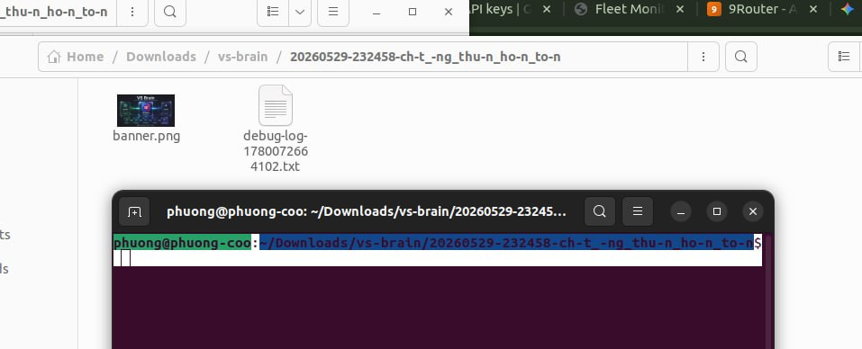

# VS Brain



VS Brain is a Chrome side-panel extension for running structured AI-to-AI critique loops across web AI tabs such as ChatGPT, Gemini, Claude, DeepSeek, Perplexity, and Grok.

It turns ad-hoc copy/paste between AI tools into a governed workflow: scan conversations, relay only the latest answer, force structured critique, stop on explicit agreement, finalize a blueprint, and preserve checkpoints when context gets too large.

Current extension version: `v0.8.48-ledger-quality-validator`.

## Why it is useful

Long AI debates fail in predictable ways:

- context grows until old requirements are diluted
- lower-tier models may replace stronger models after quota changes
- models start repeating old issues instead of reducing uncertainty
- apparent agreement can be false when the stop phrase appears too early
- final blueprints can look polished while missing unresolved blockers

VS Brain adds operational guardrails around that process.

## Branding

VS Brain now includes the supplied 1024×1024 logo as the main extension brand asset:

- side-panel hero logo
- help modal logo
- Chrome extension icons at 16/32/48/128px
- animated glow/floating treatment aligned with the glass UI buttons

## Core capabilities

### 1. One-click AI debate loop

Open two supported AI tabs, then press **Start auto**. VS Brain can:

- auto-pick source and target tabs
- extract the latest assistant answer
- build a structured critique prompt
- paste it into the other provider
- keep auto-send OFF by default for safe release
- switch direction after each round
- stop when agreement is detected or the max step limit is reached

### 2. Strong critique prompt discipline

The default prompt asks the receiving model to review from multiple roles:

- systems architect
- implementation engineer
- UX reviewer
- security/privacy reviewer
- fact/evidence checker
- product manager

The model must return verdict, critical issues, missing pieces, suggested fixes, confidence, and whether the debate should continue.

### 3. Explicit final agreement gate

VS Brain uses explicit stop phrases:

- English: `VS_BRAIN_FULL_AGREEMENT`
- Vietnamese: `CHỐT_ĐỒNG_THUẬN_HOÀN_TOÀN`

Finalize runtime now uses a hardened confirmation flow:

- if the final agreement phrase exists, finalization is `confirmed`
- if not, manual finalize requires explicit draft confirmation
- finalization is now gated by termination envelope + nonce + fail-closed checks
- judge gate can veto or require review before export
- the hardened final export path emits a structured bundle artifact

This prevents a manually stopped or degraded debate from being silently treated as fully agreed.

### 4. Quality Guard v1

During auto loops, VS Brain now tracks lightweight quality signals from the latest answer:

- repeated content hash
- no-new-issues streak
- low confidence streak
- contradiction markers
- critical/blocker markers

If repeated hash, contradiction, or low-confidence signals persist, the loop stops with a quality guard reason instead of continuing blindly. This does not prove factual correctness, but it reduces long-run drift and false confidence.

### 5. Safe tab restore / drift guard

When the user switches tabs during an auto loop, VS Brain restores the intended target tab before filling.

Guard behavior:

- validates the tab still exists
- validates it is still a supported AI tab
- focuses the correct window/tab before fill
- retries fill once after restore/rebind
- stops with `needs_attention` instead of continuing if the target remains unsafe

This avoids writing into the wrong tab or continuing blindly after UI drift.

### 6. Context Handoff Mode

Context Handoff Mode solves the “200 rounds + high context + weaker model” failure mode. It supports manual export and an automatic runtime path during loops.

When a conversation becomes too long, the user can create a handoff checkpoint instead of copying full history into a new tab.

The handoff exports:

- `vs-brain/context-handoff-<provider>-<timestamp>.md`
- `vs-brain/context-handoff-<provider>-<timestamp>.json`

Manual and auto handoff include:

- provider, title, URL, conversation id
- message count
- estimated visible context characters/tokens
- estimated context usage percentage
- loop step/max step
- last stop reason
- latest answer
- structured placeholders for:
  - requirements / invariants
  - decisions already accepted
  - resolved issues
  - unresolved issues / blockers
  - next critique focus
- bootstrap prompt for a new tab

Auto runtime behavior: during each loop step, VS Brain estimates visible context usage for the active source/target tabs. If estimated usage reaches 70%, it exports a handoff, opens a replacement tab, injects the bootstrap prompt, auto-sends when auto-send is enabled, replaces the old tab id in loop state, and resumes the loop.

Important: web UI mode cannot know true provider context usage. VS Brain marks these values as estimates. They are still useful as a guardrail.

### 7. Conversation archive and checkpointing

VS Brain can scan the current AI chat and export:

- new messages as JSONL
- new messages as Markdown
- full conversation as JSONL
- full conversation as Markdown

It stores per-conversation checkpoints in `chrome.storage.local` to avoid duplicate exports.

### 8. Final blueprint export

After finalization, VS Brain now defaults to exporting:

- final blueprint Markdown

Archive/bundle tools still exist separately for conversation export and internal artifacts.

### 9. Output modes (v0.8.47+)

The Start card has an **Output** selector that decides the shape of the final artifact, not just the dropdown label — it changes what input is required and what schema the secretary turn must return.

- **Blueprint (quick)** — default. Debate an idea and get a unified blueprint Markdown. No payload required. Best for “help me think through X” type prompts.
- **Decision Ledger (needs payload)** — requires you to paste a real evidence payload (numbers, logs, spec, doc). Every relay turn is anchored to that payload via a `<<<EVIDENCE … >>>` block, and finalize uses a Decision Ledger schema with one row per decision: `decision`, `evidence`, `counter_evidence`, `confidence`, `reverse_if`, `status`. Claims that have no payload support are marked `status: unsupported` and not presented as decisions.

Guards:

- Start is blocked with a clear status line if you select Decision Ledger but leave the payload box empty.
- The same loop core (relay, stop budgets, forced finalize, downloads) is reused; modes only swap the prompt template and inject payload, no separate control flow.
- The saved bundle records `outputMode` so you can tell at a glance whether a `.json.gz` is a blueprint or a ledger.

When to pick which:

- Pick **Blueprint** for ideation, design discussions, prompts where the answer itself is the artifact.
- Pick **Decision Ledger** when you need to defend each decision in front of an evidence-aware reviewer (auditor, code reviewer, ops lead, customer). The ledger forces the model to either cite the payload or admit it is guessing.

### 10. Decision Ledger field validator (v0.8.48+)

After finalize, when `outputMode = ledger`, a deterministic validator parses the ledger and grades it. The schema prompt asks for 5 fields per decision; this step measures how often the model actually delivered them.

- Fields counted: `evidence`, `counter_evidence`, `confidence`, `reverse_if`, `status`.
- Grade attached to bundle metadata as `ledgerQuality`:
  - **ok** — ≥80% of decision blocks have all 5 fields.
  - **partial** — 40–80%.
  - **poor** — <40%, or no decision blocks at all.
- Save log includes one explicit line, e.g.:
  `ledger validator: quality=partial decisions=4 full=2 partial=1 reasons=missing_counter_evidence_in_2_decisions|missing_reverse_if_in_3_decisions`
- The bundle still exports either way; the validator is a quality signal, not a hard block. Use it to decide whether to trust the ledger as is, or to re-run with a richer payload / stronger model.

This closes the v0.8.47 gap where the schema prompt asked for 5 fields but nothing measured compliance — the contract is no longer trust-only on the model.

## Operating model

```text
Open 2 AI tabs
→ Start auto
→ VS Brain relays latest answer only
→ providers critique each other
→ stop phrase or max steps stops loop
→ if agreement exists: Finalize confirmed
→ if no agreement: user may explicitly force draft
→ if context is too large: create Context Handoff
→ continue in a fresh tab from compressed state
```

## Safety rules

- Auto-send is optional and OFF by default, including the one-click safe-release path.
- Stop phrase is accepted only in the latest response.
- Stop phrase alone is not enough to finalize.
- Finalization requires deterministic fail-closed validation.
- Manual stop does not equal final agreement.
- Missing final agreement requires explicit user confirmation before blueprint generation.
- Handoff mode should be used when context is high, model quality drops, or debate starts repeating.
- Context estimates are heuristic in web UI mode; unreliable estimator state blocks blind auto handoff.

## Current implementation status

Implemented in `apps/extension`:

- Chrome Manifest V3 side-panel extension
- multi-provider AI tab discovery
- latest-answer extraction
- assisted relay and auto-loop
- stop phrase gate
- max step control up to 1000 via slider
- elapsed timer
- stronger final CTA glow
- safe target-tab restore
- final confirm / draft forced gate
- context handoff export
- JSONL/Markdown conversation export
- debug log export
- one-click start now hardens runtime by auto-refreshing tab inventory and clearing stale recovery state before a new loop
- source/target auto-pick now avoids same-provider fallback pairs when a different-provider target is available
- surface classification now distinguishes usable conversation vs `home` / `signin` / `interstitial` states for live providers
- Gemini home/new-chat surfaces can now be auto-bootstrapped with a short readiness prompt before the real critique relay begins
- permission/runtime failures now stop fast with explicit reasons instead of silently retrying forever

## Repo layout

```text
apps/extension/      Chrome extension for web UI export/relay
packages/shared/    Shared schemas, hashing, normalization helpers
docs/               Product/spec/design notes
exports/            Local ignored sample/export target
```

## Load locally

1. Open `chrome://extensions`.
2. Enable Developer mode.
3. Click **Load unpacked**.
4. Select `apps/extension`.
5. Pin VS Brain or open it from the side panel.

After code changes, click **Reload** on the extension card.

## Limitations

- Web UI mode cannot read exact model token usage or true provider context window usage.
- Context usage is estimated from visible DOM text and prompt payload size.
- Provider UI selectors may change; use the debug log when paste/send fails.
- Live provider automation can still be blocked by auth/interstitial/anti-bot surfaces outside the extension's control; current runtime now classifies these more explicitly instead of retrying indefinitely.
- API mode is not implemented yet.

## Version history

See `CHANGELOG.md` and `docs/ROADMAP.md`.
